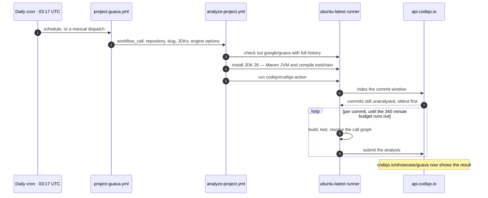
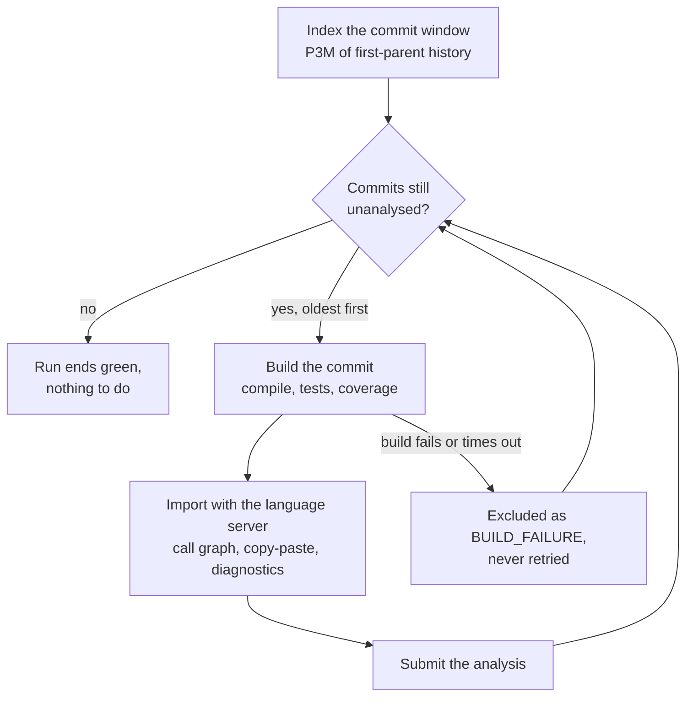

# codiqo-showcase

[](https://github.com/codiqo/codiqo-showcase/actions/workflows/project-guava.yml)

Codiqo analysing open-source projects in public, on a schedule, with the results published as
read-only dashboards anyone can open.

Nothing here is a fork or a patch of the projects being analysed. Each workflow checks a project
out, builds its recent commits, resolves the call graph of every change, and submits the result to
a Codiqo organization dedicated to that project. The build logs are public, so any number on a page
can be traced back to the run that produced it.

| Project | Workflow | Showcase page |
|---|---|---|
| [google/guava](https://github.com/google/guava) | [`project-guava.yml`](.github/workflows/project-guava.yml) | [codiqo.io/showcase/guava](https://codiqo.io/showcase/guava) |
| [ebean-orm/ebean](https://github.com/ebean-orm/ebean) | [`project-ebean.yml`](.github/workflows/project-ebean.yml) | [codiqo.io/showcase/ebean](https://codiqo.io/showcase/ebean) |

**Contents** — [How a run works](#how-a-run-works) · [Run Codiqo on your own repository](#run-codiqo-on-your-own-repository) · [Add a project to this showcase](#add-a-project-to-this-showcase) · [Project notes: guava](#project-notes-guava) · [Project notes: ebean](#project-notes-ebean) · [Reusable workflow reference](#reusable-workflow-reference) · [What bounds a run](#what-bounds-a-run) · [Troubleshooting](#troubleshooting) · [Repository layout](#repository-layout) · [Contributor privacy](#contributor-privacy)

---

## How a run works

Two files, one job. `project-guava.yml` holds everything specific to one project;
`analyze-project.yml` holds the
policy every project shares and is the only place that talks to the action.



Each commit is a complete build and is submitted on its own, so a run that stops early loses
nothing. Where a commit can leave that loop matters more than the loop itself:



Only recent commits are analysed. Older commits usually cannot be built at all: their plugin
versions and JDK expectations have long since expired, and each one that cannot resolve is
excluded after a single attempt.

## Run Codiqo on your own repository

This is the common case, and it does not need anything from this repository. Your own repository is
the one being measured, so there is no second checkout and no reusable workflow.

1. Get an API key at [codiqo.io](https://codiqo.io) and add it as the repository secret
   `CODIQO_API_KEY`.
2. Commit the workflow below as `.github/workflows/codiqo.yml`.
3. Run it once from the Actions tab and confirm the summary reports a non-zero caller count.

```yaml
name: Codiqo

on:
  schedule:
    - cron: '0 3 * * *'
  workflow_dispatch:

permissions:
  contents: read

concurrency:
  group: codiqo
  cancel-in-progress: false

jobs:
  analyze:
    runs-on: ubuntu-latest
    timeout-minutes: 340
    steps:
      - uses: actions/checkout@v7
        with:
          # Required: Codiqo skips any commit whose parent is missing locally.
          fetch-depth: 0

      - uses: codiqo/codiqo-action@main
        with:
          api-key: ${{ secrets.CODIQO_API_KEY }}
          # 25 or newer: the plugin declares requiredJavaVersion 25, and Maven refuses to run a
          # plugin whose prerequisite it cannot meet. It must also be able to build your project.
          java-version: '26'
```

Every other option is documented in [`codiqo/codiqo-action`](https://github.com/codiqo/codiqo-action).

## Add a project to this showcase

Use this path only for measuring a repository you do not own, publicly. Copy
[`project-guava.yml`](.github/workflows/project-guava.yml) to `project-<slug>.yml` — one file per
project, `analyze-project.yml` holding everything they share — and change four things:

```yaml
      target-repo: apache/commons-lang     # the repository to analyse
      showcase-slug: commons-lang          # the public page under codiqo.io/showcase/
      jdks: |                              # every toolchain version the project asks for;
        26                                 # the one running Maven goes last, and must be 25+
```

```yaml
    secrets:
      CODIQO_API_KEY: ${{ secrets.CODIQO_API_KEY_COMMONS_LANG }}
```

Then:

1. Create a Codiqo organization for the project, and add its key as a repository secret. One key per
   project keeps a mistake in one workflow away from every other page.
2. Dispatch the workflow from the Actions tab with `max-commits-per-run: 1` and
   `ignore-coverage: true`. That proves the wiring in one build rather than a hundred.
3. Confirm the analysis reports a **non-zero caller count**. Zero callers means the language server
   never built a model, not that the code has no callers.
4. Drop both overrides and let the schedule take over.

Two rules keep the key safe, and both are structural rather than a matter of care: every workflow
here triggers only on `schedule` and `workflow_dispatch`, and `analyze-project.yml` is `workflow_call`
only. No fork and no pull request can reach a secret.

## Project notes: guava

A worked example of what per-project tuning looks like, and why each line exists.

- **One JDK, and it has to be 26.** Three constraints meet at that number: `codiqo-maven-plugin`
  declares `requiredJavaVersion` 25, guava's modules bind `maven-toolchains-plugin` at JDK 26, and
  surefire selects `${surefire.toolchain.version}`, which defaults to the Maven JVM's own release.
  Installing `26` alone satisfies all three, because `setup-java` both sets `JAVA_HOME` and registers
  the toolchain entry. Upstream CI runs Maven on 26 for the same reason.
- **The `android/` mirror is excluded.** It is a file-for-file copy of guava's sources, 1,572 of
  3,227 tracked `.java` files. Copy-paste detection reads the indexed file set, so without the
  exclusion it matched the tree against its own copy and exhausted the heap twice, at 9 GB and again
  at 24 GB. Excluding it took the peak to 4 GB in 2.7 seconds and changed nothing analytically: the
  symbol count was identical, because those files carry no symbols of their own.
- **Heap is set explicitly.** A hosted runner has 16 GB and the JVM claims 25 % of it by default,
  which is 4 GB, while the diagnostics stage alone measured 4 to 7 GB on a reactor this size.
- **The schedule keeps up.** Guava landed 34 commits in the last 30 days, so once the initial `P3M`
  backlog drains, a daily run has roughly one commit to do.

## Project notes: ebean

The contrasting case: a project that needs almost nothing.

- **JDK 25, the floor rather than a preference.** Ebean compiles to release 11 and upstream CI tests
  on 21 alone, but the plugin's `requiredJavaVersion` is 25. Both 25 and 26 still accept
  `--release 11`, so 25 is the closest supported JDK to what upstream exercises. No toolchain is
  pinned, so one entry covers everything.
- **Docker is part of the build.** Five modules start containers through `ebean-test` — postgis,
  pgvector and a shared redis. A hosted runner provides it, and the image pulls are paid once per
  run rather than once per commit.
- **Nothing to exclude and nothing to tune.** No jacoco, PMD, CPD or SpotBugs of its own, no
  failsafe phase, no mirrored source tree. Every default applies unchanged.
- **Cheap by comparison.** The whole reactor builds and runs 2,669 tests in about three minutes
  locally, against roughly twenty-four minutes per commit for guava.
- **One trap.** Ebean's `default` profile is `activeByDefault` and is what contributes the `tests`
  module. Passing any other profile with `-P` deactivates it, the reactor loses every test, and the
  build still goes green with coverage at zero. Which is the argument for not adding `maven-args`
  here.

## Reusable workflow reference

`analyze-project.yml` exposes only what a project genuinely varies. Everything else is either showcase
policy, fixed on the action step, or an action default left alone.

| Input | Default | Purpose |
|---|---|---|
| `target-repo` | *required* | Repository to analyse, as `owner/name`. |
| `target-ref` | default branch | Ref to analyse. Must name a branch. |
| `showcase-slug` | *required* | Public page slug, also the concurrency key. |
| `jdks` | `26` | JDKs to install, one per line. All become toolchain entries; the **last** runs Maven, the tests and the language server, so it must be **25 or newer** — `codiqo-maven-plugin` declares `requiredJavaVersion` 25. |
| `commit-window` | `P3M` | How far back to index. See [what bounds a run](#what-bounds-a-run). |
| `max-commits-per-run` | *(empty: unbounded)* | Cap on commits per run. Empty takes every pending commit, oldest first. |
| `per-commit-timeout` | `1h` | Deadline for one commit, build and analysis together. |
| `maven-opts` | `-Xmx6g` | Heap for the analysis. The default 25 % of runner RAM is not enough for a large reactor. |
| `maven-user-properties` | *(none)* | `key=value` lines passed as `-Dkey=value`, for project-specific engine options. |
| `ignore-coverage` | `false` | Skip tests. Faster, and produces no coverage data. |

Fixed as policy, and deliberately not configurable per project:

| Setting | Value | Why |
|---|---|---|
| `fail-on-jdtls-error` | `true` | A failed import leaves every caller count at zero, which is indistinguishable from "no callers" once stored. A red run is recoverable; a page asserting a blast radius of zero is not. |
| `stop-on-first-failure` | `false` | The pending list is walked oldest-first, so one wedged commit must not block every newer one. |
| `agent-instructions` | `false` | The analysed project never opted in. Its `AGENTS.md` must not steer what we publish about it. |
| `log-commit-authors` | `false` | Logs on a public repository are public. |
| `exclude-author-emails` | `*[bot]@*` | A showcase measures human work. Narrower than the engine's `*bot*` on purpose: it catches GitHub app identities without catching a human whose address merely contains the word — guava's Google-internal changes are exported under such an address. |
| `persist-credentials` | `false` | The analysed project's own build runs over that checkout. |

## What bounds a run

What bounds a run is a clock, not a commit count.

| Bound | Value | Effect |
|---|---|---|
| Job timeout | 340 min | The real limit. Six hours is the hosted-runner maximum, and stopping short of it means Actions cancels the job, which still uploads the logs and writes the summary. |
| Per-commit deadline | 60 min | The build and test budgets are fitted under it. A commit that exceeds them is excluded as a build failure and not retried. |
| Commit window | `P3M` | Bounds what enters the index. It does **not** filter the pending list afterwards. |
| Commits per run | unbounded | Every pending commit, oldest first, until the job timeout. |

Two consequences worth internalising before the first run:

- **Widening the window queues a backlog.** `P3M` over guava enqueues on the order of 100 commits,
  and one run clears whatever fits in 340 minutes. The rest stay pending, so the schedule works
  through them over the following days. Nothing is lost, and nothing is analysed twice.
- **A cancelled run is not a failed analysis.** Every commit is submitted independently, so the
  pages fill in as the backlog drains, even while the catch-up runs are ending as cancelled.

## Troubleshooting

| Symptom | Cause | Fix |
|---|---|---|
| Summary reports zero commits pending | Shallow clone: Codiqo skips any commit whose parent is missing locally | `fetch-depth: 0` on the checkout |
| Analysis completes, every caller count is zero | The language server never imported the project | Read the import log in the run artifact. `fail-on-jdtls-error: true` turns this into a red run rather than a quiet zero |
| `The plugin ... has unmet prerequisites: Required Java version 25` | The JDK running Maven is older than the plugin allows | Make the **last** entry in `jdks` 25 or newer |
| Build fails with no toolchain found for a JDK | The project pins a toolchain the runner does not have | List every version the project asks for in `jdks`, Maven's own last |
| Killed during copy-paste detection at very high heap | The repository mirrors its own sources, so the tree matches against its copy | `maven-user-properties: codiqo.excludePaths=<tree>/**` |
| Job cancelled after 340 minutes | Backlog larger than one run's budget | Expected during a catch-up. It resumes on the next run |
| Everything appears pending again | The commit index is keyed by branch name | `analyze-project.yml` reads the branch from the checkout, so the analysed repository's name is used rather than this repository's |

Logs for every run are uploaded as an artifact named `codiqo-logs-<slug>`, kept for seven days, with
secrets redacted before upload.

## Repository layout

```
.github/workflows/
├── analyze-project.yml    shared policy, workflow_call only, never triggered directly
├── project-guava.yml      one project: schedule, repository, slug, JDKs, engine options
├── project-ebean.yml      another, needing nothing but a different JDK
└── project-<slug>.yml     ... one file per project, added the same way
```

GitHub reads workflows only from the top level of `.github/workflows`, so the convention carries the
grouping that folders would: `analyze-` is the shared machinery, `project-` is one project each.
Adding a project adds one `project-` file, and `analyze-project.yml` changes only when the policy
does.

## Contributor privacy

The projects analysed here did not ask to be measured, and their authors never opted in. So the
public pages publish the work, not the person:

- Contributor names are masked to initials — `Jane Doe` is served as `J*** D***` — and git
  addresses never leave the server.
- Commit messages are scrubbed of attribution trailers (`Co-authored-by`, `Signed-off-by`,
  `Reviewed-by`, `Reported-by`, `Acked-by`, `Tested-by` and the rest) and of any inline address.
- Seniority judgements, account data and internal HR structure are withheld entirely in public
  mode. The server is the enforcement boundary, not the client.
- CI logs are public, so author names and emails are kept out of them too.

This is not anonymity, and it is not presented as such. Commit SHAs remain on the page and resolve
to their real author upstream. What masking removes is the name from our pages and from search
indexing.

If you maintain a project analysed here and would rather it were not, open an issue and it will be
removed.
